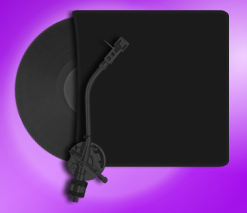
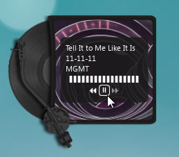
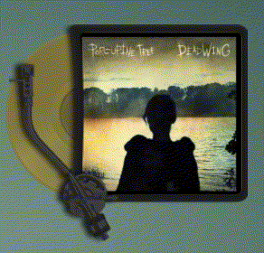

# Retro Player for KDE Plasma 6

Media controller Plasmoid for KDE Plasma 6, based on the look and feel of the [retroTunes Rainmeter skin](https://www.deviantart.com/shev-the-dev/art/retroTunes-147210621) by [shev-the-dev](https://www.deviantart.com/shev-the-dev/gallery). 

## Features

- View and control media playback from multiple MPRIS sources
- Vinyl record colorization based on the dominant color of the album art 
- Configurable rotation speed
